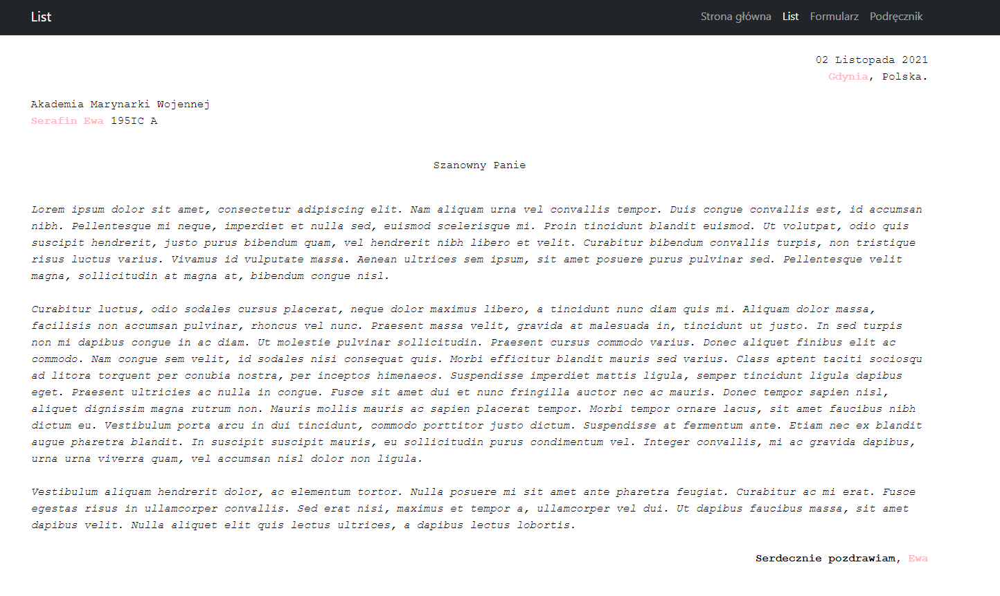
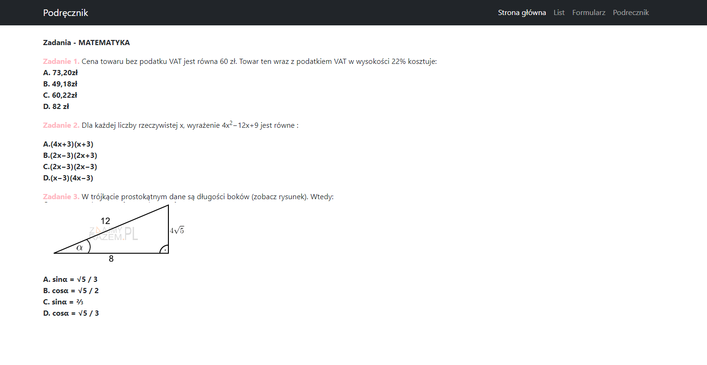
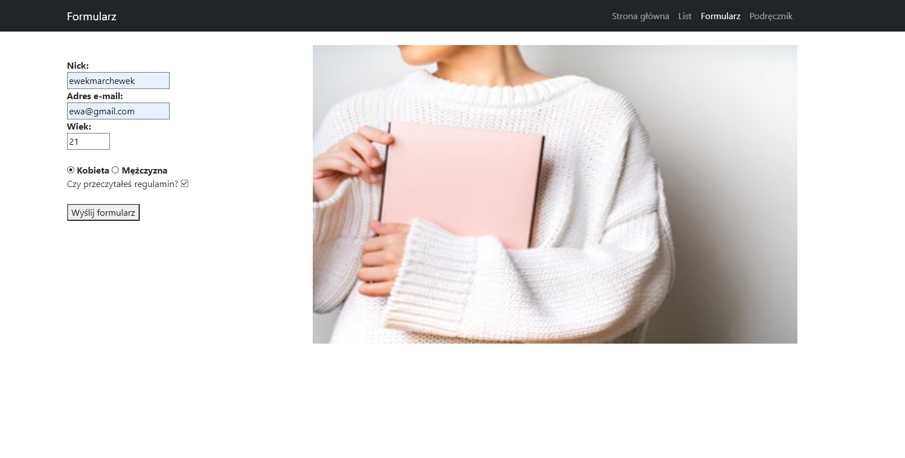

**Laboratorium 1 "Praca z systemem kontroli wersji, podstawy WWW"**
1. Strona startowa [index.html].  
Strona zawiera informacje o autorze, wykorzystany został szablon bootstrap.

  
2. List [list.html].  
Na podstronie list można zobaczyć przykładowy list tekst przedstawiony w kursywie, w formie listu - z zachowaniem jego formatowania.

  
3. Podrecznik. [podrecznik.html].  
Na podstronie podręcznik można zobaczyć przykładową kartkę z podręcznika z matematyki - zadania z poleceniami, odpowiedziami oraz rysunkami do zadań.

  
4. Formularz. [formularz.html].  
Na podstronie formularz można zobaczyć krótki formularz, składający się z inputów,checkboxa, pola radio i buttona za którego pomocą można by było przesłać formularz (aktualnie guzik nie działa)

