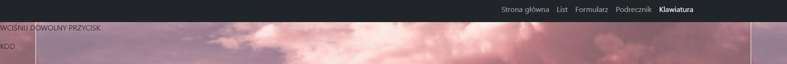
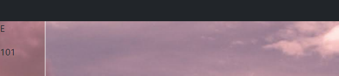
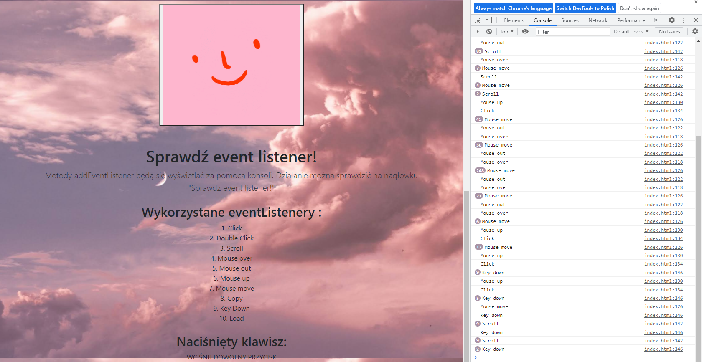
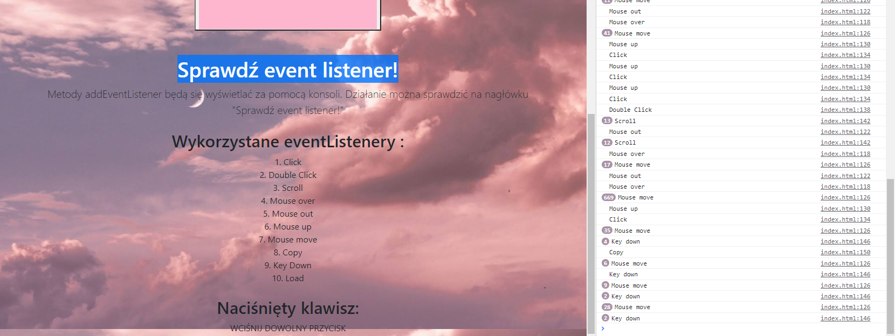

#Laboratorium 3 "Obsługa zdarzeń"
## Wyniki zastosowanych eventListenerów można odczytać w konsoli
Wykorzystane eventListenery :
1. Click
2. Double Click
3. Scroll
4. Mouse over
5. Mouse out
6. Mouse up
7. Mouse move
8. Copy
9. Key Down
10. Load

Klawiatura pozwala sprawdzić na stronie jaki jest kod danego klawisza

Przykładowo wciśnięty klawisz to E, jak widać jego kod to 101

## Wykorzystanie event listenerów można obserwować w konsoli 

