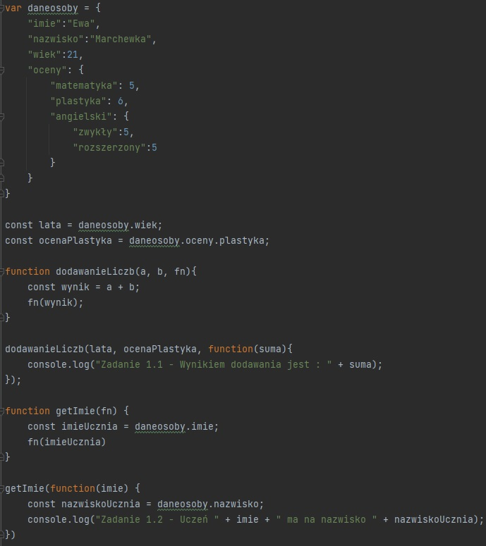
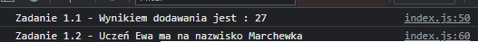
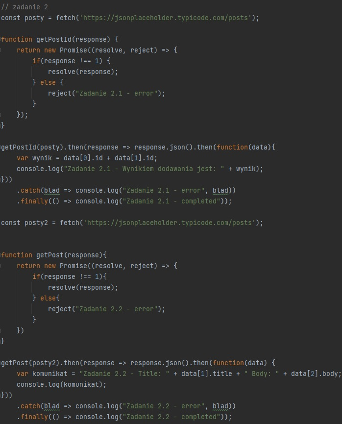
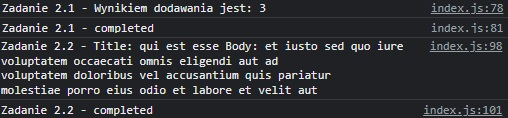
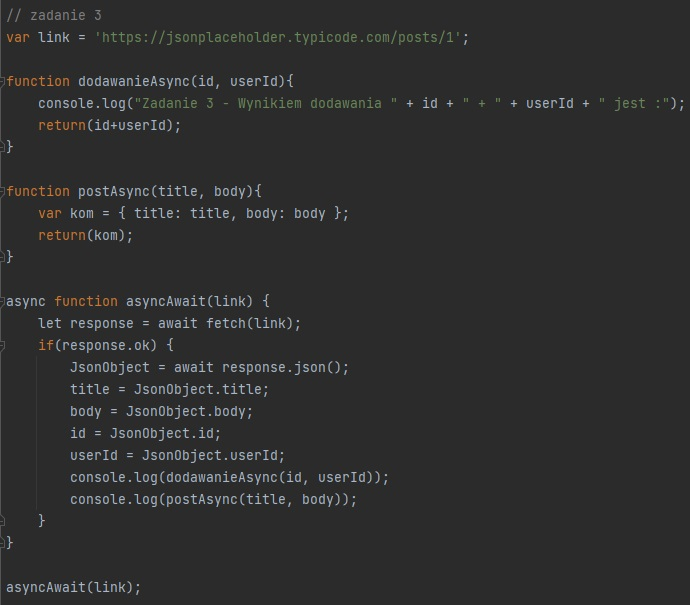
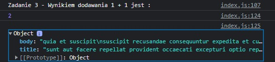
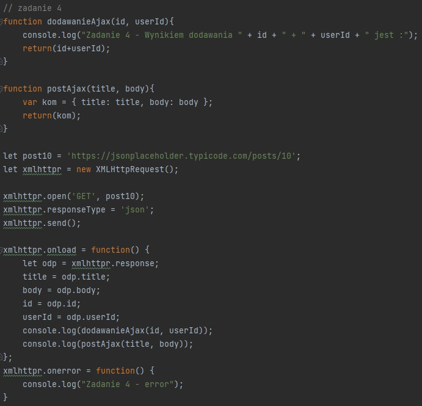
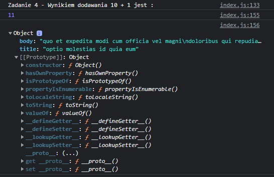
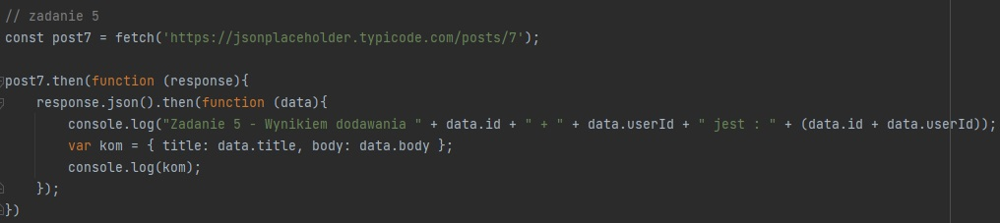
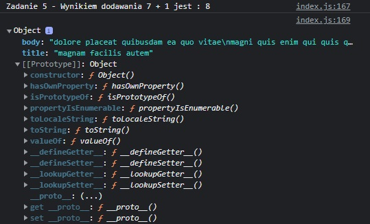

**Laboratorium 5 "Asynchroniczny Javascript"**
***
**Zadanie1**

Stworzona została klasa osoba, z której pobierają się najpierw dwie liczny, później się dodają i jako łańcuch liczbowy lądują na końcu komunikatu.
Kod do zadania :

Wynik działania :

**Zadanie2**

Dane dwie liczby pobierane są ze strony, są dodawane i z łańcuchów tworzy się nowy obiekt.
Kod do zadania :

Wynik działania :

**Zadanie3**

Tak jak poprzednio, dane pobierane są ze strony, liczby są dodawane i z łańcuchów liczbowych jest tworzony nowy obiekt. W dalszych zadaniach mozna obserwować tę samą sytuację.
Kod do zadania :

Wynik działania :

**Zadanie4**
Kod do zadania :

Wynik działania :

**Zadanie5**
Kod do zadania :

Wynik działania :

